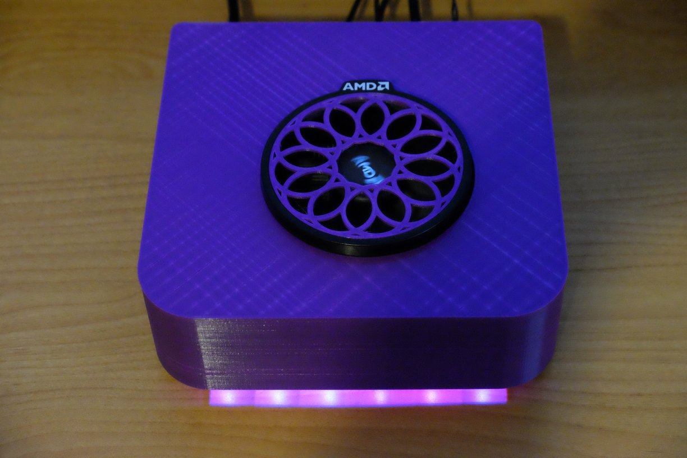

# mellori_ITX
Mellori (Little Raven) - Small Form Factor printable case for AMD Raven Ridge systems

Description
-----------

The Mellori ITX case was designed to fill the need for a small form factor case for AMD-based systems and measures
just 195x190x60mm high (plus feet). The mellori achieves this small size by combining several existing innovations.
First the AMD Raven Ridge CPUs have integrated graphics, allowing the system to omit a bulky graphics card to
reduce overall height. The back panel space where such a card would go is used for the power connector and button.
Next, by using the Minibox PicoPSU power supply, a whole lot of space is saved while moving the bulk of the supply to a brick
outside the PC. Hard disk space is reduced by using an SSD. Finally, by lowering the top of the case below the height
of the CPU cooling fan, that fan serves double duty. It cools all components while providing an aethetically pleasing feature
on an otherwise non-descript small box. Air vents are on the bottom and force air past key components before exiting.

Board Considerations
--------------------

The Mellori_ITX is motherboard-specific due to the location of the cooling fan cutout. This is easily modified by changing
two dimmensions in the CAD files that specify the center of the cooling fan/heatsink relative to the back corner of the board.
The original design was for the Gigabyte AB350N Gamng WiFi motherboard which also includes programmable LED lighting along
the front of the board - Vents allow these lights to shine down on the desk in front of the computer.

3D Printing
-----------

Mellori is designed for easy 3D printing. It is small enough to print on a 200x200mm bed and can be printed with almost no
supports. Only the 4 small hex holes on the bottom need any support. The original version used thermal inserts for
board mounting and the design can easily be modified if that's your preference.

The case consists of 4 printed parts:
1) The base which includes vents and standoffs for mounting an ITX motherboard.
2) The back includes a cutout for standard ITX back panel and holes for a power connector and button.
3) The top - which may require relocation of the fan cutout if another board is used (default is AB350N).
4) A fan grill for the AMD Wraith-Stealth Cooler is included. It should be a light press fit.

All of these parts are easy to print. A small test part is included to verify your ability to print the supports
for the screws before wasting a lot of time and material on the whole thing. The hex holes on the bottom are for M3
nuts but they are larger than the screw holes they are under so support material is needed.

Back Panel Considerations
-------------------------

The back panel is a simple extrusion, so changing it for a different power connector or button is easily done
using solvespace. The power connector cutout is for the 160W Pico-PSU from Minibox. The 120W Pico PSU is probably
enough but it has a different connector. Feel free to experiment. The hole for a power button was designed to fit
a small LED-lit button I found on Amazon. I think it was this one:

https://www.amazon.com/CynKen-Symbol-Momentary-Latching-Switch/dp/B06VVYNJ2J/

